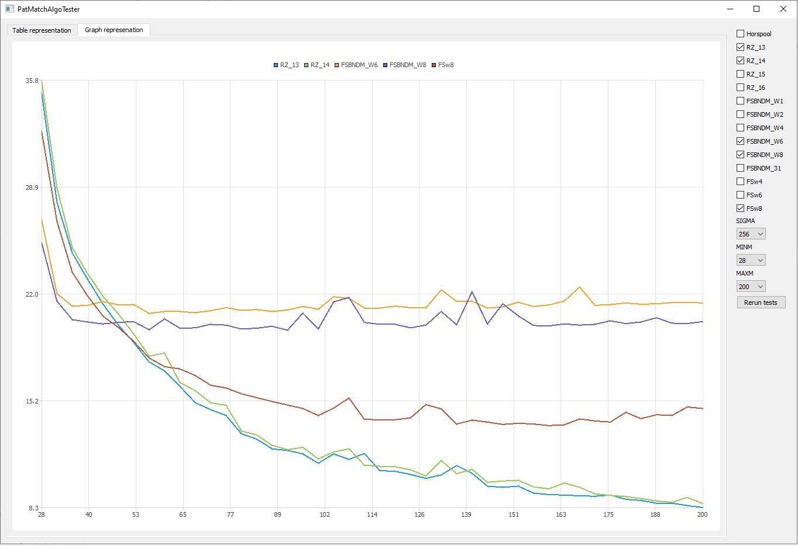
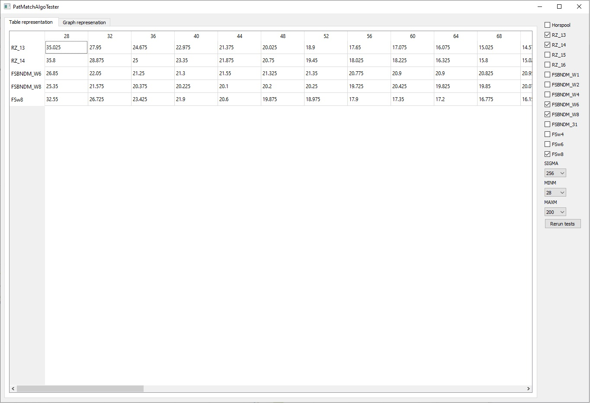

# PatternMatchingAlgorithmsTester

Appliction is developed for testing pattern matching algorithms correctness and time usage  
Results are repsresented in both table and graph forms  
Most parameters as well as used algorithms are configurable using UI  

Application uses QtCreator  
Requires QtCharts to be installed  
Tested on Qt 5.15.2 on Windows  

